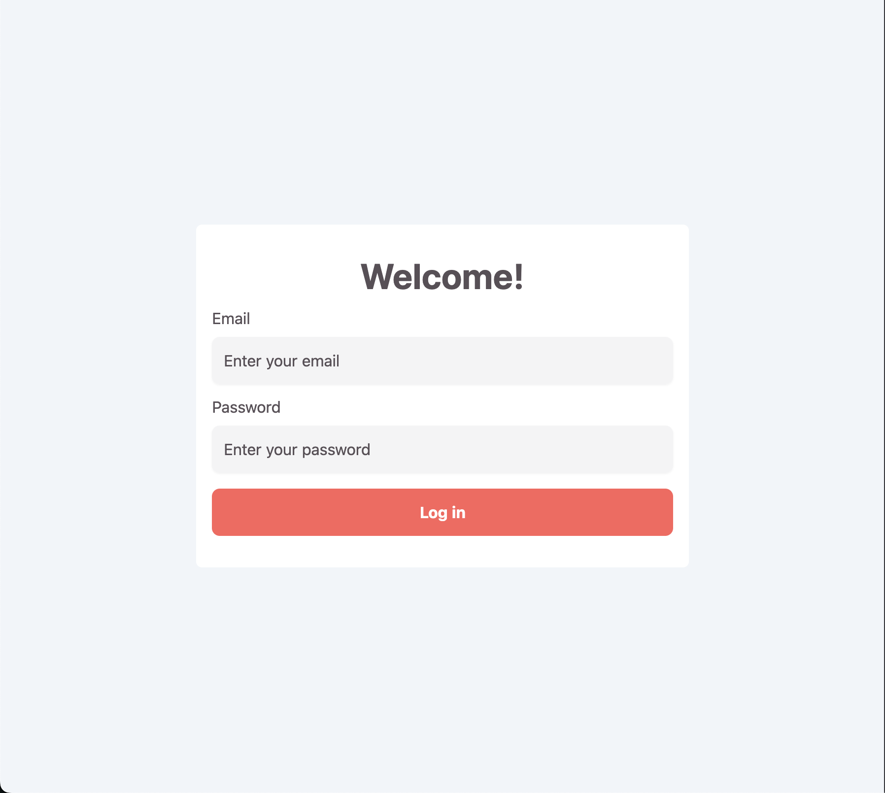
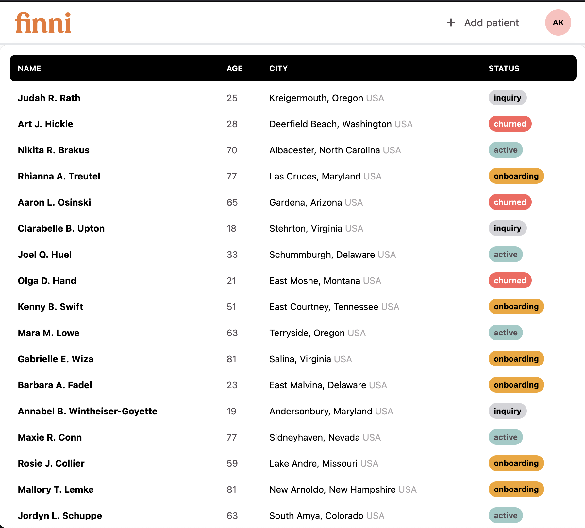
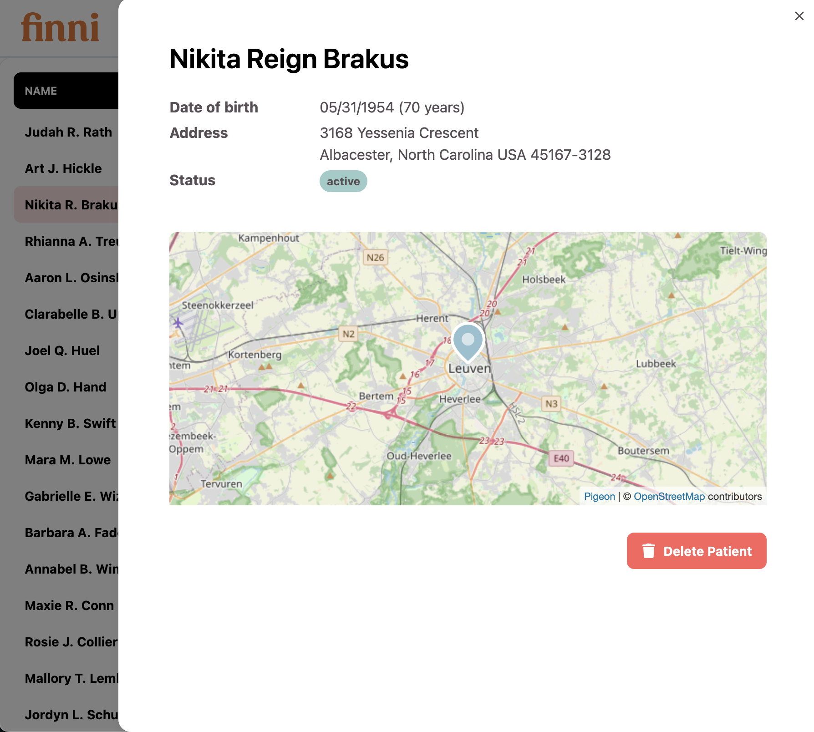

# Finni Patient Health Dashboard

Hi Yilun, Eloi, and Jacob. Here is my take on the new patient health dashboard interview. This was a fun exercise and I found myself getting carried away by it, but it was getting late and I wanted to submit something!


There were a bunch of things I couldn't get to like error notifications, auth, and caching, but maybe I can step through how I would implement some of these in the followup retro interview?

Tech Stack:
- Vite/React/Tailwind/React Query
- Express
- Supabase/Docker

## Running locally

Prerequisites:
- node, Docker

```bash
// To seed db with dummy data
supabase start
supabase db reset

// To start services
cd finni
npm install
npm run serve

// To stop services
npm run db:stop


```

## Review

### Login page
`/login`



A barebones form that accepts any combination of email and password now as long as it's valid. 

**Improvements**
* Use a better typing and validation library like zod

### Table View
`/dashboard`



For the first pass of this dashboard I went with one dashboard page where a provider would be able to see a complete list of their patients. 

**Improvements:**
* Add empty and loading states to table
* Add table pagination
* Add sort and filtering (FE api layer is setup)

### Patient Detail Drawer



If a provider wants to dig deeper into a specific patient, they can click a patient row to open up a drawer. For now the data is super sparse, but I can see it holding critical medical information like phenotypes, diagnoses, medication, etc. that might not make sense to show in the table view.

**Improvements:**
* Make map work with address
  * Find external zip code to coordinates api and integrate so that map works
* Persist selected person key in url as search param so that a link can be shared with the correct patient open

### Data
To keep everything simple, I only created one `patients` table. This can be expanded on as we collect and display more data.

**Improvements**
* Split out address from patient table to be a separate Address table instead of json field
* Add a user metadata table that holds more information about providers

## Future features/fixes that would be good to work on:

* Implement add patient page
* Add proper auth
* Add caching layer to backend
* Add profile page
* Error toasts and proper error handling/propagation
